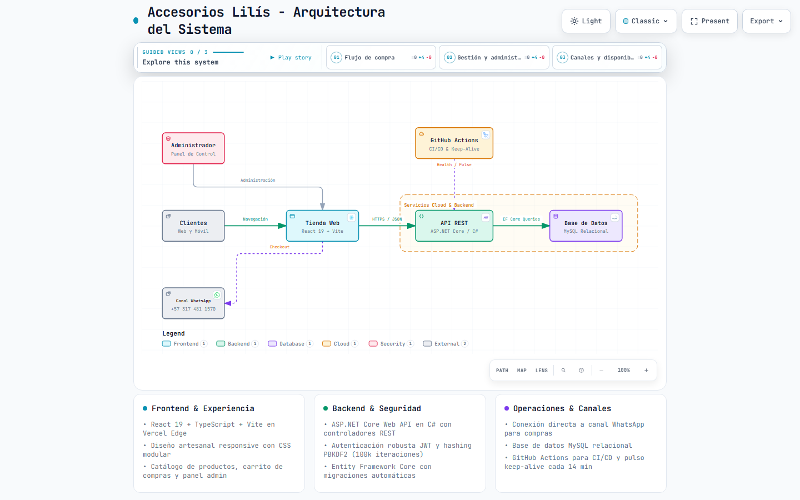

# 💎 Accesorios Lilís - Plataforma Web Oficial & E-Commerce Artesanal

Plataforma de comercio electrónico y catálogo interactivo creada para el emprendimiento familiar de **Liliana Lombana Polanía** en **Algeciras (Huila, Colombia)**. Especializada en la confección minuciosa de bisutería, aretes, collares, pulseras y piezas exclusivas 100% hechas a mano.

---

## 📌 Datos Generales del Emprendimiento

* **Fundadora & Artesana:** Liliana Lombana Polanía
* **Desarrollador & Administrador Tecnológico:** Brayan Stid Cortés Lombana
* **Ubicación Principal (Google Maps):** Algeciras, Huila (Lat: `2.5343338`, Lng: `-75.3057016`)
* **Sedes:**
  * 🏡 **Taller Artesanal:** Lugar de confección, pedidos personalizados y despachos.
  * 🛒 **Punto de Venta Fin de Semana:** Carrito artesanal en la Galería Municipal de Algeciras (sábados y domingos).
* **Canal de Contacto Oficial:** WhatsApp (+57 317 481 1570)
* **Tienda Web en Vivo (Producción):** [https://accesorios-lilis-2026.vercel.app](https://accesorios-lilis-2026.vercel.app)

---

## 🏗️ Arquitectura del Sistema

El proyecto está diseñado bajo una arquitectura desacoplada, reactiva y moderna. Puedes interactuar en tiempo real con el mapa del sistema directamente en tu navegador:

<p align="center">
  <a href="https://accesorios-lilis-2026.vercel.app/arquitectura.html" target="_blank" rel="noopener noreferrer" title="Haz clic para abrir el mapa interactivo en vivo">
    <picture>
      <source media="(prefers-color-scheme: dark)" srcset="architecture-diagram.dark.png">
      <source media="(prefers-color-scheme: light)" srcset="architecture-diagram.light.png">
      
    </picture>
  </a>
</p>

<p align="center">
  <a href="https://accesorios-lilis-2026.vercel.app/arquitectura.html" target="_blank" rel="noopener noreferrer">
    
  </a>
  &nbsp;
  <a href="https://accesorios-lilis-2026.vercel.app" target="_blank" rel="noopener noreferrer">
    
  </a>
</p>

> [!TIP]
> **Experiencia 100% interactiva:**  
> Al hacer clic en el diagrama o en el botón morado superior, se abre [**`arquitectura.html`**](https://accesorios-lilis-2026.vercel.app/arquitectura.html) desplegado en producción. Podrás alternar entre modo oscuro/claro, activar vistas guiadas de compra o administración, buscar nodos y rastrear el alcance de cualquier componente (*upstream* / *downstream*) con fluidez.

### Estructura del Repositorio

```text
accesorios-lilis/
├── frontend/                          # Cliente Web (React 19 + TypeScript + Vite)
│   ├── public/                        # Archivos estáticos de verificación, robots, favicons y avatares
│   │   ├── favicon.svg                # Ícono oficial de la marca para navegadores
│   │   ├── vendedora_avatar_circle.png# Avatar oficial en alta resolución y primer plano de Liliana
│   │   ├── vendedora_lili_full.png    # Escena 3D completa de la vendedora en Algeciras
│   │   ├── robots.txt                 # Control de rastreo para buscadores
│   │   ├── sitemap.xml                # Mapa de indexación para Google
│   │   └── google3aa4b55c9aef9eb7.html# Archivo de verificación Google Search Console
│   ├── src/
│   │   ├── api/                       # Clientes HTTP para Auth, Productos, Pedidos y Categorías
│   │   ├── app/App.tsx                # Componente raíz y orquestador de vistas
│   │   ├── components/                # Componentes (ProductImageModal, InteractiveTutorialModal, etc.)
│   │   ├── hooks/                     # Hooks reutilizables (useAuth, useCart, useProducts)
│   │   ├── services/                  # Servicios (guidedTourService.ts con driver.js)
│   │   ├── styles/                    # Sistema de diseño modular en CSS puro
│   │   └── types/                     # Interfaces TypeScript estrictas
│   └── index.html                     # Entrada HTML con metadatos OpenGraph y Schema.org LocalBusiness
│
├── backend/                           # API REST (ASP.NET Core Web API + C#)
│   ├── AccesoriosLilis.Api/           # Proyecto principal de la API
│   │   ├── Business/                  # Lógica del negocio y reglas de validación
│   │   ├── Data/                      # Capa de persistencia y consultas Entity Framework
│   │   ├── Entity/                    # Modelos, DTOs, DbContext y migraciones
│   │   ├── Utilities/                 # Hashing de claves PBKDF2 y sanitización XSS
│   │   └── Web/Controllers/           # Controladores REST expuestos
│   └── AccesoriosLilis.Tests/         # Pruebas Unitarias Oficiales (.NET xUnit)
│       ├── InputSanitizerTests.cs     # Validación de protección contra inyecciones XSS
│       └── PasswordHasherTests.cs     # Validación de hashing PBKDF2 y tiempo constante
│
├── tests/                             # Suites de Integración y Seguridad en Python
│   ├── test_cookie_auth.py            # Ciclo de vida de autenticación por cookies HttpOnly
│   ├── test_security_hardening.py     # Blindaje OWASP, Rate Limiting y XSS
│   ├── test_orders_and_stock.py       # Descuento atómico de stock y transacciones ACID
│   ├── test_categories_management.py  # Creación y cascada de colecciones
│   ├── run_all_tests.py               # Ejecutor maestro consolidado
│   ├── run_tests.bat                  # Script rápido para Windows
│   └── README.md                      # Manual del centro de pruebas
│
├── .github/workflows/                 # Automatización CI/CD
│   ├── promote-pipeline.yml           # Pipeline de auto-escalado a Producción
│   └── keep-alive.yml                 # Pulso anti-suspensión cada 14 min (Backend + DB)
├── escalar.bat                        # Script local de 1 solo clic para despliegues
└── README.md
```

---

## 🌸 Tour Guiado Interactivo (Guided Product Tour) & Avatar Oficial

En lugar de simples mensajes estáticos, la plataforma cuenta con un **sistema de onboarding guiado en vivo** mediante `driver.js`:

* **Efecto Spotlight / Reflector:** La pantalla se atenúa con un desenfoque elegante (`backdrop blur`) mientras que la sección o botón explicado se ilumina con un recorte brillante y sombra pulsante.
* **Desplazamiento Suave (Smooth Scroll):** La cámara viaja automáticamente por la tienda física hacia el elemento correspondiente.
* **Globos Flotantes con la Vendedora Liliana:** Cada popover muestra el avatar en primer plano de **Liliana Lombana**, con su trenza, aretes y sonrisa acogedora, guiando al usuario con un lenguaje claro y cercano para cualquier edad.
* **Doble Modalidad:**
  * 🛍️ **Tour del Cliente (6 Pasos):** Colecciones por categoría, buscador inteligente, visualización de joyas con zoom, compra a la bolsa y asesoría por WhatsApp.
  * 👑 **Tour del Administrador (6 Pasos):** Creación de productos con fotos a la nube en WebP, inventario con eliminación en 2 vías, gestión de categorías, auditoría de pedidos y seguridad de accesos.
* **Nuevo Avatar Oficial en Alta Resolución:** Creado a partir del render 3D de la tienda frente a la iglesia de Algeciras ([`vendedora_avatar_circle.png`](file:///frontend/public/vendedora_avatar_circle.png)).

---

## 🔍 Catálogo Inteligente, Vitrina de Vendidos y Zoom de Fotos

* **Vista Ampliada con Zoom Interactivo (Lightbox):**
  * Al hacer clic o tocar cualquier fotografía de joya, se abre en tamaño grande con fondo oscuro difuminado.
  * **Múltiples formas de zoom:** Botones `+` y `−` (hasta 350%), rueda del mouse, doble clic (1x ↔ 2.2x), botón de reinicio `%` y arrastre fluido con mouse o dedo en pantallas táctiles (pan a 60 fps).
  * **Cierre fácil en 1 segundo:** Botón rojo visible `Cerrar ✕`, clic en cualquier parte del fondo exterior o tecla `Escape`.
* **Doble Vitrina de Productos:**
  * 🟢 **Disponibles para Entrega:** Joyas en inventario listas para despacho con botón `+ Agregar a mi bolsa`.
  * ✨ **Vitrina de Piezas Vendidas:** Obras de arte confeccionadas previamente que las clientas pueden solicitar a través del botón **"✨ Mandar a Elaborar"** por encargo personalizado.
* **Rotación Dinámica del Catálogo:** Algoritmo que rota periódicamente las joyas en la portada para que los clientes recurrentes siempre descubran piezas distintas.

---

## 👑 Panel Administrativo & Eliminación Segura en Dos Vías

* **Subida Automática de Fotografías:** Carga directa desde celular o PC con optimización instantánea a la nube (Cloudinary) en formato WebP de alta velocidad.
* **Eliminación Inteligente en Dos Vías:**
  * **Archivado Seguro (Soft-Delete):** Si una joya ya tuvo ventas históricas, el sistema bloquea su borrado destructivo para proteger el balance contable y la archiva con marca temporal (`deleted_at`), permitiendo reactivarla con 1 clic en cualquier momento.
  * **Eliminación Definitiva (Hard-Delete):** Si una pieza nunca tuvo pedidos registrados, se elimina por completo de la base de datos para no dejar basura digital.
* **Gestión de Colecciones en Cascada:** Al renombrar o actualizar una categoría, todos los productos vinculados actualizan su referencia automáticamente.
* **Gestión de Pedidos & WhatsApp:** Transición de estados (*Pendiente ➔ Empacando 📦 ➔ Enviado 🚚 ➔ Entregado 💎*) con apertura de WhatsApp con mensajes automáticos pre-redactados.

---

## 🔐 Blindaje de Seguridad OWASP y Autenticación Criptográfica

* **Sanitización de Entradas (`InputSanitizer.cs`):** Neutralización de inyecciones XSS, etiquetas HTML maliciosas, iframes y patrones de scripting.
* **Cifrado Fuerte de Contraseñas:** Algoritmo PBKDF2-SHA256 con salt criptográfico individual (100.000 iteraciones) y verificación con comparación en tiempo constante (`CryptographicOperations.FixedTimeEquals`) contra ataques de temporización (timing attacks).
* **Cabeceras HTTP de Seguridad:** Inyección de `X-Content-Type-Options: nosniff`, `X-Frame-Options: DENY`, `Referrer-Policy: strict-origin-when-cross-origin` y supresión de la cabecera informativa `Server`.
* **Rate Limiting Adaptativo:** Bloqueo de peticiones sospechosas o ataques de fuerza bruta por IP con respuesta HTTP `429 Too Many Requests`.
* **Manejo Seguro de Excepciones:** Mensajes de error controlados que previenen la fuga de esquemas internos o trazas de MySQL.
* **Autenticación Oficial con Google Identity Services** y soporte para cookies seguras `HttpOnly`.

---

## 🧪 Centro de Pruebas Automatizadas (Testing Center)

El repositorio incluye suites completas de pruebas unitarias y de integración para validar la calidad del sistema antes de cada despliegue:

```text
============================================================
                RESUMEN GENERAL DE PRUEBAS                 
============================================================
  [APROBADO]   | Pruebas Unitarias .NET (xUnit)
  [APROBADO]   | Autenticacion por Cookies HttpOnly
  [APROBADO]   | Flujo de Pedidos e Inventario
  [APROBADO]   | Gestion de Categorias en Cascada
  [APROBADO]   | Blindaje OWASP, Rate Limiting y XSS
============================================================
```

### Ejecución de Pruebas:
```bash
# Correr todas las pruebas con un solo comando:
python tests/run_all_tests.py

# O en Windows con el script de 1 clic:
.\tests\run_tests.bat

# Correr solo pruebas unitarias en .NET:
dotnet test backend/AccesoriosLilis.Tests/AccesoriosLilis.Tests.csproj
```

---

## ⚙️ Variables de Entorno (Plantilla de Seguridad)

> [!IMPORTANT]
> **Nunca incluyas contraseñas reales ni claves secretas en este archivo ni en el repositorio.**  
> Todos los valores confidenciales se configuran como variables de entorno privadas en el servidor de despliegue.

### Frontend (`frontend/.env`)
```env
# URL de la API Backend (en desarrollo local o servidor cloud)
VITE_API_URL=http://localhost:5000/api

# Client ID de Google Cloud Console (Identificador público)
VITE_GOOGLE_CLIENT_ID=tu_google_client_id_aqui.apps.googleusercontent.com
```

### Backend (`appsettings.json` / Variables de Entorno)
```json
{
  "ConnectionStrings": {
    "DefaultConnection": "Server=localhost;Database=accesorios_lilis;Uid=tu_usuario_db;Pwd=tu_contrasena_db;"
  },
  "Jwt": {
    "Key": "tu_clave_secreta_jwt_minimo_32_caracteres_aleatorios",
    "Issuer": "AccesoriosLilis",
    "Audience": "AccesoriosLilis",
    "ExpireHours": "48"
  },
  "AdminEmails": "lombanaliliana64@gmail.com,brayanstidcorteslombana@gmail.com",
  "Google": {
    "ClientId": "tu_google_client_id_aqui.apps.googleusercontent.com"
  }
}
```

---

## 🚀 Estrategia de Ramas y Pipeline CI/CD

El proyecto utiliza un flujo de despliegue continuo escalonado:

$$\text{development} \xrightarrow{\text{Tests \& Build}} \text{qa} \xrightarrow{\text{Estabilidad}} \text{main (Vercel Producción)}$$

### Despliegue Automático en la Nube
Al hacer push a `development`, el workflow [`.github/workflows/promote-pipeline.yml`](file:///.github/workflows/promote-pipeline.yml):
1. Instala y compila el frontend con TypeScript estricto (`npm run build`).
2. Si la compilación es exitosa, fusiona y sube a `qa`.
3. Posteriormente fusiona y sube a `main`.
4. Vercel detecta la actualización en `main` y despliega la versión de producción en vivo.

### Despliegue Local de 1 Clic (`escalar.bat`)
Desde la terminal en tu computadora puedes ejecutar:
```cmd
.\escalar.bat "descripción de las mejoras realizadas"
```
El script se encarga de confirmar cambios, sincronizar las ramas y regresar a `development` de forma desatendida.

### ⏰ Pulso Anti-Suspensión Keep-Alive (`keep-alive.yml`)
* **Frecuencia:** Se ejecuta de manera automática cada 14 minutos (`cron: '*/14 * * * *'`).
* **Acción:** Envía una solicitud HTTP a `/health` y `/api/products` del backend, ejecutando una verificación ligera sobre MySQL (`db.Database.CanConnectAsync()`).
* **Efecto:** Mantiene tanto el contenedor web como el pool de conexiones de la base de datos despiertos 24/7.

---

## 📈 Optimización para Buscadores (SEO) y Google Maps

* **Google Search Console:** Propiedad verificada oficialmente mediante archivo HTML y metaetiqueta.
* **Sitemap & Robots:** Archivos [`sitemap.xml`](file:///frontend/public/sitemap.xml) y [`robots.txt`](file:///frontend/public/robots.txt) dinámicos para guiar a los rastreadores.
* **Datos Estructurados (Schema.org):** Declaración de comercio local (`JewelryStore`) con geolocalización satelital precisa de Algeciras, datos de contacto y horarios.
* **Mapa Embebido Oficial:** Mapa interactivo con enlace directo a la ficha comercial en Google Maps.
* **Open Graph:** Tarjetas enriquecidas al compartir enlaces en WhatsApp, Facebook e Instagram con logotipo oficial y avatar de la vendedora.

---

## 🛠️ Comandos de Desarrollo Local

### Iniciar Frontend:
```bash
cd frontend
npm install
npm run dev
```

### Iniciar Backend:
```bash
cd backend/AccesoriosLilis.Api
dotnet restore
dotnet run
```

### Compilar para Producción:
```bash
cd frontend
npm run build
```

